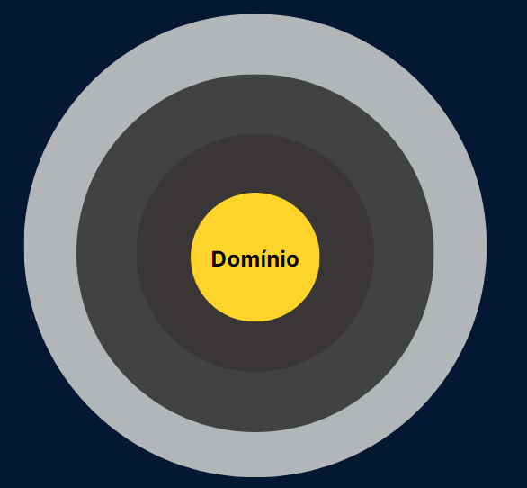

# A Camada de Domínio na Arquitetura Limpa

Ao construir uma casa, o primeiro passo seria chamar um engenheiro para desenhar a planta da casa, pois seria pouco inteligente construí-la sem planejamento. Essa planta mostra os cômodos e como os pedreiros devem trabalhar na obra.

A **camada de domínio**, em **arquitetura limpa (Clean Architecture)**, é uma espécie de planta da casa que estipula como essa casa será construída.

O objetivo dessa camada é **centralizar as regras de negócios** em um local independente de qualquer detalhe de implementação, como interfaces de usuário, frameworks ou bancos de dados. Essa camada é responsável por representar o **núcleo da aplicação**, onde as regras de negócios são definidas e aplicadas.

---

## Representação Visual

Imagem que representa as camadas da arquitetura limpa ou clean code.  
Há várias esferas que envolvem uma a outra. A esfera do centro está na cor amarela e dentro dela pode-se ler a palavra **“domínio”**.



## Estrutura da Camada de Domínio

A camada de domínio, geralmente, consiste em **três componentes principais**:

### 1. Entidades  

As **entidades** são objetos que encapsulam os conceitos de negócios essenciais; são geralmente classes chamadas de **models** e representam informações do projeto (como a model `Entry` do nosso projeto).  

Elas **não devem conter lógica relacionada à infraestrutura ou à apresentação**. A tendência é que essas entidades sejam **imutáveis**.

#### Exemplo de entidade `User`:

```dart
class User {
  final int id;
  final String name;
  final String email;

  User(this.id, this.name, this.email);
}

## 2. Casos de Uso (Use Cases)  

Os **casos de uso** representam as operações de negócios que a aplicação pode executar.  
Eles orquestram a lógica de negócios usando as entidades e validam as regras de negócios.

Cada **caso de uso** tem um **único propósito** e deve ser independente de detalhes externos, como banco de dados ou interfaces de usuário.

---

### Criar um Novo Usuário  

Esse caso de uso permite **criar um novo usuário** no sistema.

#### Implementação:

```dart
class CreateUserUseCase {
  final UserRepository _userRepository;

  CreateUserUseCase(this._userRepository);

  Future<void> execute(User user) async {
    // Lógica de negócios para criar um novo usuário
    await _userRepository.createUser(user);
  }
}
Aqui está o conteúdo formatado corretamente em **Markdown**:  

```md
## 2. Casos de Uso (Use Cases)  

Os **casos de uso** representam as operações de negócios que a aplicação pode executar.  
Eles orquestram a lógica de negócios usando as entidades e validam as regras de negócios.

Cada **caso de uso** tem um **único propósito** e deve ser independente de detalhes externos, como banco de dados ou interfaces de usuário.

---

### Criar um Novo Usuário  

Esse caso de uso permite **criar um novo usuário** no sistema.

#### Implementação:

```dart
class CreateUserUseCase {
  final UserRepository _userRepository;

  CreateUserUseCase(this._userRepository);

  Future<void> execute(User user) async {
    // Lógica de negócios para criar um novo usuário
    await _userRepository.createUser(user);
  }
}
```

---

### Buscar um Usuário por ID  

Esse caso de uso permite **buscar um usuário** pelo seu identificador único (ID).

#### Implementação:

```dart
class GetUserByIdUseCase {
  final UserRepository _userRepository;

  GetUserByIdUseCase(this._userRepository);

  Future<User?> execute(int userId) async {
    return await _userRepository.getUserById(userId);
  }
}
```

---

### Atualizar um Usuário  

Esse caso de uso permite **atualizar as informações** de um usuário existente.

#### Implementação:

```dart
class UpdateUserUseCase {
  final UserRepository _userRepository;

  UpdateUserUseCase(this._userRepository);

  Future<void> execute(User user) async {
    await _userRepository.updateUser(user);
  }
}
```

---

### Deletar um Usuário  

Esse caso de uso permite **remover um usuário** do sistema.

#### Implementação:

```dart
class DeleteUserUseCase {
  final UserRepository _userRepository;

  DeleteUserUseCase(this._userRepository);

  Future<void> execute(int userId) async {
    await _userRepository.deleteUser(userId);
  }
}
```

---

## 3. Repositórios  

Os **repositórios** são **interfaces** que definem como os casos de uso podem interagir com os dados, como buscar ou salvar entidades.

#### Exemplo de um repositório para operações de usuário:

```dart
abstract class UserRepository {
  Future<void> createUser(User user);
  Future<User?> getUserById(int userId);
  Future<void> updateUser(User user);
  Future<void> deleteUser(int userId);
}
```

---

## Benefícios da Camada de Domínio  

A ideia central da **camada de domínio** é manter a **independência das regras de negócios** do restante da aplicação. Isso traz várias vantagens:

✅ **Facilidade de manutenção**: As regras de negócios não dependem de detalhes externos.  
✅ **Facilidade de testes**: Você pode testar as regras de negócios sem precisar de interfaces gráficas ou banco de dados reais.  
✅ **Flexibilidade**: O código fica modular e pode ser reutilizado em diferentes partes da aplicação.  

---

## Conclusão  

A **Arquitetura Limpa** é uma abordagem poderosa que pode ser implementada em várias linguagens.  
Os exemplos acima foram escritos em **Dart**, mas os conceitos podem ser aplicados a qualquer tecnologia.
